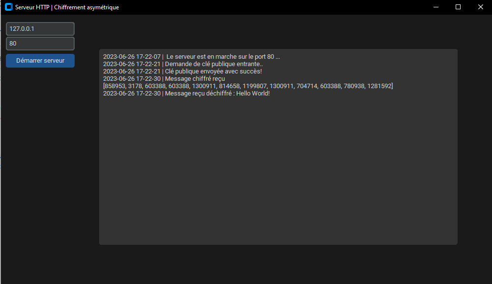
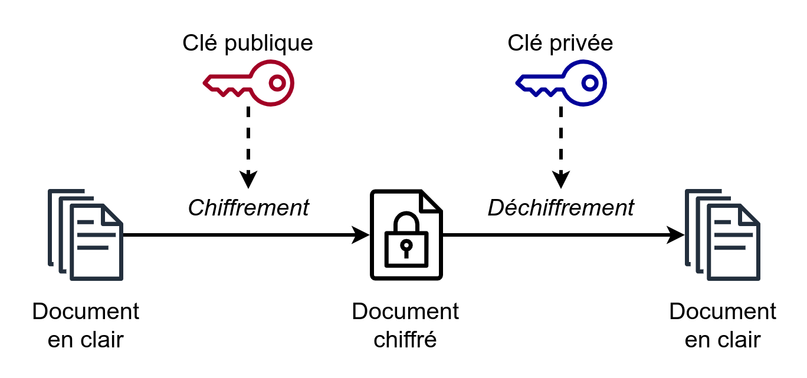
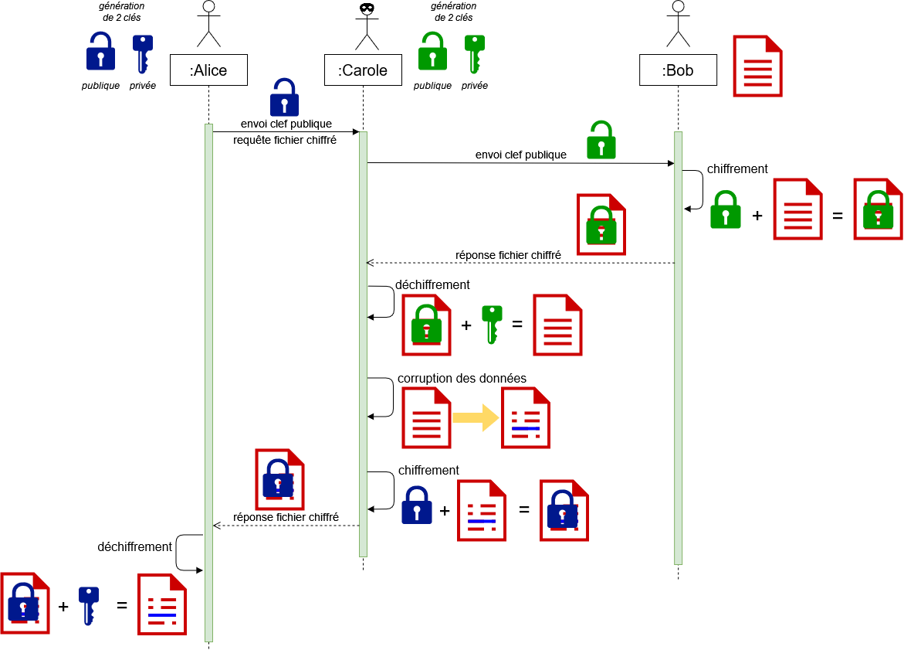

<h3 align="center">Secure-Http-Server</h3>

<p align="center">
    A python http server running with an RSA asymmetric encryption implementation.
    <br>
    
_Warning: For professional use, please use the SSL/TLS (HTTPS) protocol._
 
## About The Project


### Built With
Librairies 
* [Math](https://docs.python.org/3/library/math.html)
* [Requests](https://github.com/psf/requests)
* [http.server](https://docs.python.org/3/library/http.server.html)
* [Random](https://docs.python.org/fr/3/library/random.html)
* [Tkinter](https://docs.python.org/fr/3/library/tkinter.html)
* [CustomTkinter](https://customtkinter.tomschimansky.com/)
* [Threading](https://docs.python.org/fr/3/library/threading.html)
* [Json](https://docs.python.org/fr/3/library/json.html?highlight=json#module-json)
* [Time](https://docs.python.org/fr/3/library/time.html?highlight=time#module-time)
* [Base64](https://docs.python.org/fr/3/library/base64.html?highlight=base64#module-base64)

  
## Encryption functionning
To prevent the man-in-the-middle attack, communication encryption exists.

### Symetric encryption
There are 2 types of encryption, symmetrical and asymmetrical.
Symmetric encryption involves using 2 identical private keys for two clients or for a client and a server. One encrypts its message with its key and the other decrypts it with the same key. 


If a hacker manages to intercept the message, it will be encrypted and therefore unreadable without the key. But if the hacker manages to intercept the very first communication, which consists of giving the key to the other, then he will be able to decrypt all the messages he intercepts afterwards. 

Asymmetric encryption must therefore be implemented.

### Asymetric encryption
Asymmetric encryption is based on the use of 2 different keys. A public key and a private key.

Initially, the server has both keys, and the client neither. When the client makes a secure communication request to the server, the server provides the public key. 

The client can then encrypt its message using the public key supplied. It then sends the encrypted message to the server, which decrypts it using its private key. This key is not shared.

the asymmetric encryption used is the RSA mathematical algorithm, based on Fermat's Little Theorem of modular arithmetic.

### Example of an RSA algorithm

* Choose two prime numbers p = 3, q = 11 ;
* Their product n = 3 × 11 = 33 is the encryption modulus ;
* φ(n) = (3 - 1) × (11 - 1) = 2 × 10 = 20 ;
* Choose e= 3 (prime with 20) as the encryption exponent ;
* The decryption exponent is d = 7, the inverse of 3 modulo 20 (ed = 3 × 7 ≡ 1 mod 20).

The public key is (n, e) = (33, 3), and the private key is (n, d) = (33, 7). 

* Encryption of M = 4 the public key: 43 ≡ 31 mod 33, the encrypted is C = 31 
* Decryption of C = 31: 317 ≡ 4 mod 33, the original message M = 4 is found.
  
### Asymmetric encryption flaw
A hacker can pretend to be a server and generate his own public and private key. The client therefore thinks it is communicating with the real server, when in fact it is communicating with the pirate.

The hacker will then decrypt and recover the client's message before pretending to be the client, re-encrypting the message with the real server's public key and sending it to the server so as not to arouse suspicion.



## Getting Started

To get a local copy up and running follow these simple steps.

### Prerequisites
You need to install Python, that can be done [here](https://www.python.org)

### Installation
1. Clone the repo
   ```sh
   git clone https://github.com/KursK-sys/Secure-Http-Server.git
   cd Secure-Http-Server
   ```
2. Install Python packages
   ```sh
   pip install -r requirements.txt
   ```
   
#### Or this can be done using android with unrooted Termux
```
git clone https://github.com/KursK-sys/Secure-Http-Server.git
pkg install python
pip install -r requirements.txt
cd Secure-Http-Server
```
## Usage

Run the `server.py` on server side and `client.py` on client side.

### In server.py
There is an graphic interface, with two user entry zones, one for the server IP address and the other for the port. 
* Default: 127.0.0.1 and 80
You can then start the server by click on the button and see all events in textbox.

### In client.py
In first you need to set correct server IP and port in the code.
Default: 127.0.0.1 and 80
Type a message in client and see it in server.py in the logs textbox made for it. 

## LICENSE
MIT License

Copyright (c) 2022 KursK

Permission is hereby granted, free of charge, to any person obtaining a copy
of this software and associated documentation files (the "Software"), to deal
in the Software without restriction, including without limitation the rights
to use, copy, modify, merge, publish, distribute, sublicense, and/or sell
copies of the Software, and to permit persons to whom the Software is
furnished to do so, subject to the following conditions:

The above copyright notice and this permission notice shall be included in all
copies or substantial portions of the Software.

THE SOFTWARE IS PROVIDED "AS IS", WITHOUT WARRANTY OF ANY KIND, EXPRESS OR
IMPLIED, INCLUDING BUT NOT LIMITED TO THE WARRANTIES OF MERCHANTABILITY,
FITNESS FOR A PARTICULAR PURPOSE AND NONINFRINGEMENT. IN NO EVENT SHALL THE
AUTHORS OR COPYRIGHT HOLDERS BE LIABLE FOR ANY CLAIM, DAMAGES OR OTHER
LIABILITY, WHETHER IN AN ACTION OF CONTRACT, TORT OR OTHERWISE, ARISING FROM,
OUT OF OR IN CONNECTION WITH THE SOFTWARE OR THE USE OR OTHER DEALINGS IN THE
SOFTWARE.
